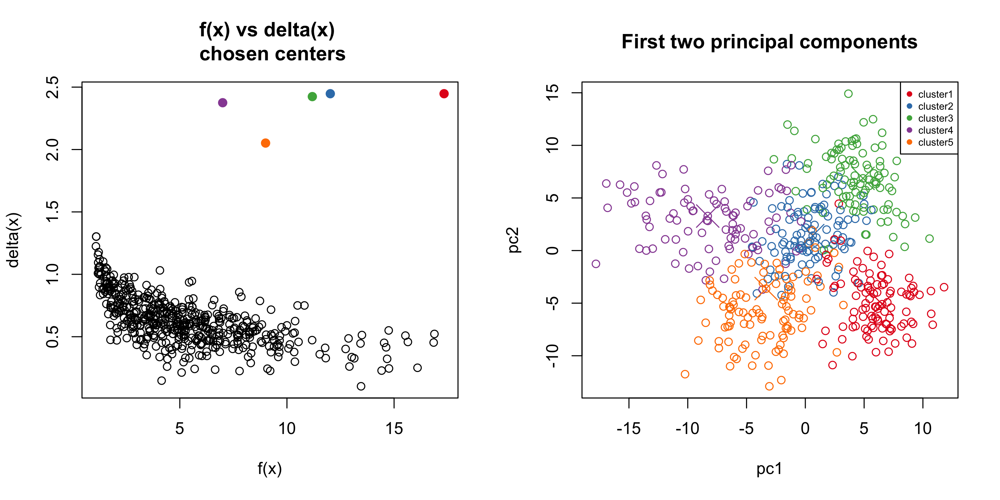

This page provides installation instruction and usage examples for the R package **ADPclust**. Please see the paper for details of the procedure:

* Wang, Xiao-Feng, and Xu, Yifan. "Fast clustering using adaptive density peak detection." _Statistical methods in medical research (2015) doi\:10.1177/0962280215609948_

Most recent developments are in [this GitHub repo](https://github.com/ethanyxu/ADPclust). 

## Introduction

ADPclust is a non-iterative procedure that finds the number of clusters and cluster assignments of large amount of high dimensional data by identifying cluster centroids from estimated local densities. The procedure is built upon the work by Rodriguez [2014]. ADPclust automatically identifies cluster centroids from a projected two dimensional decision plot that separates cluster centroids from the rest of the points. This decision plot is generated from the local density $f(\mathbf{x})$ and an "isolation" score $\delta(\mathbf{x})$ for each data point $\mathbf{x}$.  
  For a data set $\{\mathbf{x}_1, \ldots, \mathbf{x}_n\}$ where each $\mathbf{x}_i$ is a d dimensional vector, ADPclust first estimates the local multivariate Gaussian density $f(\mathbf{x}_i), i=1,\ldots,n$ by

$$\hat{f}(\mathbf{x}_i; h_1,...h_d) = n^{-1} \left(\prod_{l=1}^d h_l \right)^{-1} \cdot \sum_{j=1}^n K\left(\frac{x_{i1} - x_{j1}}{h_1}, ..., \frac{x_{id} - x_{jd}}{h_d}\right).
$$
where $h_1,...,h_d$ are bandwidths at each dimension. Two default $h$ values are provided in ADPclust: 

1. *rule-of-thumb (ROT)* bandwidth by Scott [2002]
2. *asymptotic mean integrated squared error (AMISE)* bandwidth by Wand [1994]. 

Other bandwidths can also be specified if the default values don't give satisfactory results.

  Given density estimation $\hat{f}(\mathbf{x}_i), i = 1,...,n$, the "isolation" indices $\delta(\mathbf{x}_i)'s$ are found by:

$$\hat{\delta}(\mathbf{x}_i) = \min_{j:\hat{f}(\mathbf{x}_i) < \hat{f}(\mathbf{x}_j)}{d(\mathbf{x}_i,\mathbf{x}_j)}.$$

where $d(\mathbf{x}_i,\mathbf{x}_j)$ is the distance between $\mathbf{x}_i$ and $\mathbf{x}_j$. 

  The scatter plot of $(\hat{f}(\mathbf{x}_i), \hat{\delta}(\mathbf{x}_i)), i = 1,...,n$ is called a decision plot, from which $k$ centroids are selected automatically or manually from the upper-right corner, and all other points are clustered according to their distances to the closest centroid.

  The average silhouette score is calculated after clusters are assigned, and is used to chose the best number of clusters among a sequence of testing $k$'s.

## Installation 
Run the following line to install the package.
```{r, eval=FALSE}
install.packages("ADPclust", repos = "http://cran.us.r-project.org")
```

Run the following line to load the package.
```{r}
library(ADPclust)
```

## Example 1: Automatic centroids selection in ADPclust

### Default settings
The automatic centroids selection by ADPclust finds the best bandwidth $h$ and number of clusters $k$ from a grid of $(h,k)$ pairs. By default, the testing $h's$ are 10 values evenly spread in the interval $[1/3h_0, 3h_0]$, where $h_0$ is the Wand's asymptotic mean integrated squared error bandwidth (AMISE). The default testing cluster numbers are $k = 2,\ldots,10$. Here's a simple example:

```{r, fig.height=2.8, fig.width=7}
# Load a simple simulated data set with 3 clusters.
data(clust3)
ans <- adpclust(clust3)
# Above is equivalent to 
# ans <- adpclust(clust3, centroids = "auto")
```

The output of ADPclust `ans` is an object of class `adpclust` associated with `summary` and `plot` methods. `plot(ans)` produces a figure similar to the one shown above. `summary(ans)` gives a fitting summary:

```{r}
summary(ans)
```

### Changing the Bandwidth h
We can change the reference bandwidth $h_0$ to Scott's rule-of-thumb (ROT) value by setting `htype = "ROT"`:

```{r, eval=FALSE}
# Result is similar. Not shown.
ans <- adpclust(clust3, htype = "ROT")

```

Passing a specific value to the optional argument `h` specifies the bandwidth and suppresses `htype`. If a numeric vector is passed to `h` then every entry of it is tested to find the one given the best clustering result, according to average silhouette. Note `h` is a relative value so manually setting its value often requires trial and error.  

```{r, eval=FALSE}
# Setting a single h. Result not shown.
ans <- adpclust(clust3, h = 10)
# Setting a vector of testing h's. Result not shown.
ans <- adpclust(clust3, h = c(10, 12, 18))
# Setting h to the 'ROT' bandwidth. result not shown. 
ans <- adpclust(clust3, h = ROT(clust3))
```

### Changing the number of clusters
The number of (testing) cluster(s) can be set by the `nclust` argument. 
```{r, fig.height=2.8, fig.width=7}
# Setting different testing cluster numbers
ans <- adpclust(clust3, nclust = 2:15)
# Specifying one cluster number. 
# Note in this case silouette vs. tested h values is shown instead of silouette vs. k
ans <- adpclust(clust3, nclust = 3)
```

### Change outliers cutoff
Another important argument is `f.cut`, denoting the cutoff value of $f's$ (red dotted line in the middle figure) for centroid/outlier discrimination. Points to the right of the line with high $delta's$ are potential cluster centroids. Points to the left of it with high $delta's$ are potential outliers. `f.cut` is the percentile value of $f$ with default value at 10%.

```{r, fig.height=2.8, fig.width=7}
# Load a data set with 10 clusters
data(clust10)
ans <- adpclust(clust10, f.cut = 0.1, nclust = 3:15, h = ROT(clust10))
```

Setting `f.cut` to different values could result in different cluster assignment. In the following case `f.cut` is obviously set too high:

```{r, fig.height=2.8, fig.width=7}
ans <- adpclust(clust10, f.cut = 0.9, nclust = 3:15, h = ROT(clust10))
```

## Example 2: User interactive centroids selection in ADPclust
ADPclust also allow user to interactively select cluster centroids from the $(f(x), \delta(x))$ decision scatter plot. After running the following line, the first figure below is displayed, on which you can click arbitrary number of centroids, then hit "ESC" to end selection. The right figure then shows the corresponding clustering result.

```{r, eval = FALSE}
data(clust5.1)
ans <- adpclust(clust5.1, centroids = "user")
```


